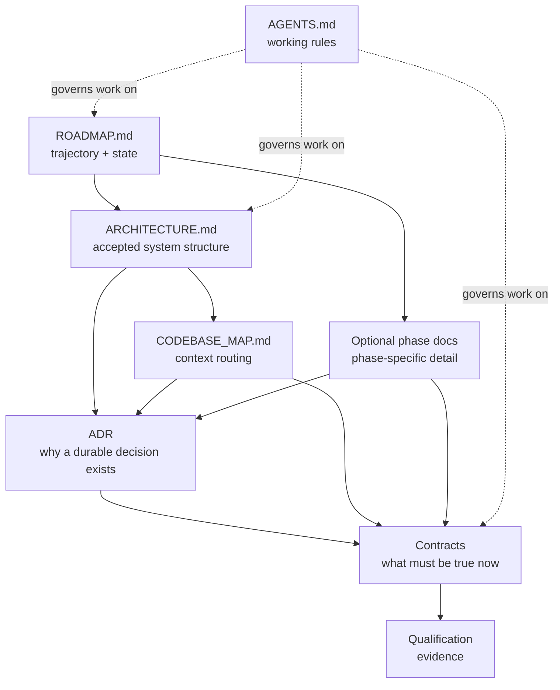

# Modèle documentaire des projets

## Objectif

Ce modèle définit **où vit chaque type d'information** et comment un agent doit charger le contexte d'un projet sans lire inutilement l'ensemble de la documentation.

Il ne prescrit pas un nombre fixe de fichiers. Un petit projet peut n'utiliser que `AGENTS.md`, `ARCHITECTURE.md` et `ROADMAP.md`. Les autres autorités apparaissent uniquement lorsqu'elles apportent une séparation utile.

## Principe d'autorité unique

Une information normative doit avoir **une autorité principale unique**.

- Les autres documents la référencent au lieu de la recopier.
- Une reformulation ne doit pas créer une seconde définition concurrente.
- Lorsqu'une information change, mettre à jour son autorité puis les références réellement affectées.
- Si deux autorités applicables se contredisent, ne pas arbitrer silencieusement : rendre le conflit explicite et le résoudre avant de poursuivre si la tâche en dépend.

Il n'existe pas nécessairement une hiérarchie linéaire entre tous les documents : **l'autorité dépend de la question posée**.

## Autorités et responsabilités

| Autorité | Question principale | Contenu attendu | À éviter |
|---|---|---|---|
| `AGENTS.md` | Comment travailler dans ce périmètre ? | règles permanentes d'exécution, validation, sécurité, discipline Git, conventions transversales | architecture détaillée, historique, état des phases |
| `ARCHITECTURE.md` | Comment le système accepté est-il structuré ? | modèle architectural, frontières, ownership, direction des dépendances, flux majeurs | roadmap, journal de décision, tâches |
| `CODEBASE_MAP.md` | Où se trouvent les responsabilités pertinentes ? | modules, chemins, ownership, dépendances majeures, liens vers contrats/ADR | inventaire exhaustif des fichiers, détails d'implémentation |
| `adr/*` | Pourquoi cette décision durable a-t-elle été prise ? | contexte, décision, rationale, conséquences, alternatives significatives | contrat vivant détaillé, TODO, journal d'implémentation |
| `contracts/*` | Qu'est-ce qui doit être vrai actuellement ? | invariants, frontières, interfaces, sémantiques, pré/postconditions, comportements d'échec | historique de décision, prose explicative répétitive |
| `ROADMAP.md` | Où allons-nous et où en sommes-nous ? | phases, état, gates, dépendances, prochain travail, liens vers détails | architecture détaillée, contrats complets, résultats de tests détaillés |
| `phases/*` | Que faut-il conserver de spécifique à une phase complexe ? | scope, découpe utile, références, qualification attendue, décisions temporaires non autoritatives | duplication des autorités globales |
| `qualification/*` | Quelles preuves ont été obtenues ? | résultats, mesures, commandes, artefacts, limites | redéfinition du contrat ou de l'architecture |

## Relations entre documents



Les flèches représentent des relations utiles, pas une obligation de créer tous les fichiers.

## ADR et contrat

ADR et contrat sont **séparés conceptuellement** :

- l'ADR conserve la raison d'une décision durable ;
- le contrat définit le comportement ou la frontière normative actuelle.

Un petit ADR peut contenir quelques conséquences normatives sans créer de contrat séparé. Dès que le contrat devient suffisamment riche, évolutif ou directement utilisé par plusieurs tâches/tests, il doit vivre dans une autorité dédiée et l'ADR doit simplement le référencer.

## Roadmap et documents de phase

`ROADMAP.md` doit rester un index lisible de la trajectoire et de l'état courant.

Créer un document de phase seulement lorsqu'il évite de surcharger la roadmap, par exemple lorsque la phase :

- nécessite plusieurs tranches ;
- possède beaucoup d'invariants ou de critères de qualification spécifiques ;
- conserve des résultats intermédiaires utiles entre sessions ;
- nécessite un contexte détaillé qui ne mérite pas une autorité globale.

Le document de phase référence les autorités pertinentes ; il ne les recopie pas.

## Architecture et structure physique

`CODEBASE_MAP.md` représente les **frontières de compréhension et d'ownership**, pas chaque dossier ni chaque fichier.

Codex peut créer ou réorganiser des sous-dossiers lorsque des fichiers frères forment une sous-responsabilité cohésive. Cette réorganisation physique n'impose pas de créer un nouveau nœud architectural.

Un sous-ensemble mérite d'apparaître comme sous-module architectural lorsqu'il possède une responsabilité stable et nommable, des frontières ou dépendances propres, ou lorsqu'il devient utile de le router séparément pour la compréhension et les modifications.

## Routage du contexte

Par défaut, un agent doit charger le contexte progressivement :

```text
Task / current prompt
        ↓
applicable AGENTS.md
        ↓
ROADMAP.md when project state or phase matters
        ↓
CODEBASE_MAP.md when code location/ownership is not already obvious
        ↓
only the relevant architecture / ADR / contract / phase / qualification sources
        ↓
relevant code
```

Règles :

- ne pas lire toute la documentation « au cas où » ;
- suivre les références explicites lorsque la tâche en dépend ;
- ouvrir une autorité globale seulement si elle porte une contrainte applicable ;
- préférer un lien précis à une copie de contenu ;
- si une tâche nécessite une décision absente des autorités, ne pas la déduire silencieusement lorsque cette décision est structurante.

## Politique de taille

La concision est une propriété de conception :

- une phrase normative précise vaut mieux que plusieurs reformulations ;
- supprimer les sections vides ou non pertinentes ;
- éviter l'historique narratif dans les autorités vivantes ;
- déplacer les preuves détaillées dans `qualification/*` ;
- déplacer la rationale durable dans un ADR ;
- déplacer les détails d'une grosse phase hors de la roadmap ;
- ne pas créer un nouveau fichier lorsque quelques lignes dans l'autorité existante sont suffisantes et cohésives.

L'objectif n'est pas de minimiser les tokens à tout prix, mais de **réduire le contexte inutile sans perdre de décision ni de précision**.
