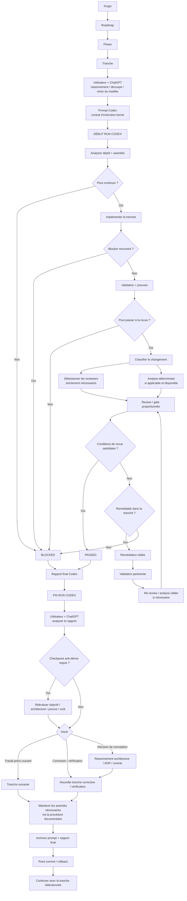

# Workflow d’ingénierie

## Objectif

Ce document décrit le workflow d’ingénierie global utilisé pour concevoir, exécuter, revoir et faire évoluer un projet.

Il s’agit d’un **guide de processus**, et non d’une autorité propre au projet.

La vérité spécifique au projet réside dans les autorités du dépôt définies par `DOCUMENTATION_MODEL.md`, par exemple :

- `AGENTS.md` ;
- `ARCHITECTURE.md` ;
- `CODEBASE_MAP.md` ;
- `ROADMAP.md` ;
- les ADR ;
- les contrats ;
- les éventuels plans de phase.

Le workflow explique comment le travail passe de la discussion à un run Codex borné, comment ce run est revu en interne, puis comment son rapport final revient à l’utilisateur et à ChatGPT pour décider de la suite.

Lorsque le skill global `maintain-project-authorities` est installé, il constitue la procédure
opérationnelle de référence pour créer, modifier sémantiquement, revoir ou compacter les
autorités structurées. Il applique `DOCUMENTATION_MODEL.md` et les guides du dépôt ; il ne les
remplace pas comme source d'autorité.

---

## Modèle de base

Le workflow sépare trois types d’état.

### 1. État de raisonnement

Principalement géré dans la discussion entre l’utilisateur et ChatGPT.

Il peut contenir :

- des hypothèses ;
- des alternatives ;
- des questions non résolues ;
- du raisonnement architectural ;
- la découpe en tranches ;
- le choix du modèle et du niveau de raisonnement ;
- l’interprétation des rapports Codex terminés ;
- les décisions concernant la prochaine tranche ou un travail correctif.

L’état de raisonnement est volontairement non autoritaire et peut évoluer librement.

Une possibilité discutée ici ne doit jamais devenir silencieusement une exigence du projet.

### 2. État d’autorité

Stocké dans le dépôt.

Il contient les connaissances durables et acceptées du projet :

- architecture ;
- ownership et routage du codebase ;
- ADR ;
- contrats ;
- état de la roadmap ;
- éventuels plans de phase ;
- autres autorités explicites du projet.

Chaque fait normatif doit avoir un emplacement autoritaire principal unique.

Les autorités vivantes représentent l'état actuellement accepté et sont mises à jour en
remplaçant l'état supersédé, pas en accumulant la chronologie des runs. Les ADR et rapports de
qualification conservent au contraire des décisions ou preuves durables selon leur propre
sémantique.

### 3. État d’exécution

Produit pendant un run Codex et sa boucle de revue.

Il comprend :

- le prompt d’exécution ;
- l’analyse et l’implémentation Codex ;
- les résultats de validation ;
- Sonar ou toute autre analyse déterministe ;
- les constats des reviewers ;
- les tentatives de remédiation ;
- le rapport final Codex.

L’état d’exécution constitue de la preuve et de la provenance. Il ne devient pas automatiquement une autorité du projet.

---

## Positionnement : Spec-Driven Development

Le workflow s’inscrit dans une logique de **Spec-Driven Development (SDD)** au sens large : expliciter le **quoi**, les contraintes et les critères d’acceptation avant de déléguer le **comment** de l’implémentation.

La spécification n’est pas nécessairement concentrée dans un fichier `spec.md`. Sur un projet existant, elle peut être distribuée entre plusieurs autorités complémentaires :

- la roadmap et le plan de phase pour l’objectif et la trajectoire ;
- l’architecture pour les frontières et responsabilités acceptées ;
- les ADR pour la rationale des décisions durables ;
- les contrats pour les invariants et comportements normatifs ;
- la tranche pour le delta de travail courant et ses critères d’acceptation ;
- le prompt pour transformer ce delta en contrat d’exécution borné.

Le workflow étend cette logique au-delà de la séquence spécification → implémentation en ajoutant notamment :

- des autorités vivantes et séparées par responsabilité ;
- un chargement progressif du contexte ;
- une validation proportionnée au risque ;
- une revue indépendante sélectionnée selon la nature du changement ;
- une boucle de remédiation ;
- un statut terminal `BLOCKED` lorsque le contrat ne peut pas être satisfait proprement ;
- un checkpoint anti-dérive lorsque les corrections locales commencent à remettre en cause la conception.

La spécification guide l’exécution mais ne doit pas rigidifier artificiellement le projet. Lorsqu’une hypothèse, un contrat ou une direction architecturale se révèle incorrecte, le workflow doit permettre de revenir au raisonnement et aux autorités concernées plutôt que de forcer l’implémentation à respecter un plan devenu mauvais.

---

## Hiérarchie du travail

La hiérarchie par défaut est :

```text
PROJET
  ↓
ROADMAP
  ↓
PHASE
  ↓
TRANCHE
  ↓
PROMPT
  ↓
RUN CODEX
  ↓
RAPPORT FINAL
  ↓
DÉCISION UTILISATEUR + CHATGPT
  ↓
TRANCHE SUIVANTE / TRANCHE CORRECTIVE
  ↓
COMMIT / CONTINUATION
```

Tous les projets n’ont pas besoin de tous ces niveaux.

Les petits projets peuvent ne pas avoir de phases explicites.

Les phases simples peuvent être entièrement décrites dans `ROADMAP.md`.

Un document de plan de phase dédié n’est créé que lorsque la roadmap deviendrait autrement trop chargée.

---

## Projet et roadmap

La roadmap décrit :

- l’évolution prévue du projet ;
- les grandes phases ;
- les dépendances importantes ;
- l’état actuel ;
- les gates ;
- les liens vers les documents de phase détaillés lorsque nécessaire.

La roadmap reste volontairement compacte.

Elle ne doit pas dupliquer l’architecture, les contrats, la justification des ADR, les rapports d’implémentation ni les détails complets des revues.

---

## Phase

Une phase représente un objectif ou jalon significatif du projet.

Une phase peut contenir une ou plusieurs tranches.

Un document de plan de phase dédié est optionnel et ne doit être créé que lorsque la phase nécessite suffisamment de contexte local, de séquencement, de contraintes ou de critères d’acceptation pour le justifier.

---

## Tranche

Une tranche est l’unité bornée de travail par défaut donnée à Codex.

Elle peut être plus large qu’une tâche humaine traditionnelle.

Une tranche doit être :

- cohérente ;
- revue indépendamment ;
- suffisamment bornée pour garder le contexte et le coût cognitif maîtrisables ;
- assez petite pour conserver un rollback pratique ;
- assez grande pour produire un incrément utile au niveau du projet.

Une tranche peut être divisée lorsque la décomposition réduit le coût cognitif ou permet à un modèle moins capable d’exécuter le travail de manière fiable.

Une tranche bloquée ne disparaît pas. Son résultat peut conduire à une tranche dédiée de correction, d’investigation ou de redesign.

Une tranche bloquée ne justifie pas automatiquement une tranche corrective : lorsque le blocker peut remettre en cause la prémisse de conception, le checkpoint anti-dérive doit être exécuté avant de définir la tranche suivante.

---

## Prompt

Le prompt Codex est le **contrat d’exécution borné** de la tranche.

Il est généré à partir de :

- l’état courant du raisonnement et des décisions ;
- les autorités du dépôt applicables ;
- le delta spécifique à la tranche.

Le prompt ne doit pas dupliquer les informations durables déjà disponibles dans les documents autoritaires.

Lorsque l'impact documentaire est prévisible, le prompt doit borner le **delta documentaire**
attendu au niveau des autorités concernées (par exemple état/gate de roadmap, ownership de
codebase map, rapport de qualification) au lieu de demander génériquement de recopier le rapport
« dans la documentation ». Un delta peut explicitement être `none`.

Son rôle est de définir :

- l’objectif exact ;
- le périmètre et les exclusions ;
- les invariants spécifiques à la tranche ;
- les exigences de validation et de preuve ;
- les conditions de blocage ;
- le rapport final attendu.

La construction du prompt suit `prompts/CODEX_PROMPT_GUIDE.md`.

---

## Choix du modèle

Le choix du modèle et du niveau de raisonnement doit dépendre principalement du **coût cognitif**, et non du nombre brut de fichiers ou de lignes.

Les signaux pertinents incluent :

- l’étendue du contexte nécessaire ;
- le couplage sémantique ;
- l’impact architectural ;
- le nombre d’invariants en interaction ;
- l’incertitude ;
- la quantité de nouveau raisonnement nécessaire ;
- la difficulté de validation ;
- le risque d’erreur silencieuse.

Lorsqu’une tranche est trop exigeante :

```text
                tranche difficile
                       │
           ┌───────────┴───────────┐
           │                       │
      décomposable             irréductible
           │                       │
           ▼                       ▼
   diviser en tranches       augmenter le modèle /
   plus petites              niveau de raisonnement
```

L’escalade du modèle ne doit pas remplacer la décomposition lorsque celle-ci améliore matériellement la fiabilité, la revue ou le coût.

Un exécuteur peut signaler que le modèle assigné ou la tranche est insuffisant. Tout redesign significatif ou redirection architecturale retourne dans la couche de raisonnement utilisateur + ChatGPT.

---

# Run Codex

Un **run Codex** est le chemin d’exécution complet d’une tranche.

Il commence lorsque l’agent Codex principal reçoit le prompt de tranche.

Il se termine uniquement lorsque l’agent principal produit un rapport final avec un statut terminal tel que :

- `PASSED` ou un statut accepté équivalent ;
- `BLOCKED`.

Le run inclut sa propre analyse, implémentation, validation, revue, remédiation et consolidation.

L’utilisateur et ChatGPT n’interviennent normalement pas à l’intérieur d’un run sain.

---

## 1. Analyse initiale

L’agent Codex principal :

1. lit le `AGENTS.md` applicable ;
2. identifie le contexte actif de roadmap / phase / tranche ;
3. suit uniquement les autorités pertinentes pour la tâche ;
4. inspecte l’état réel du dépôt ;
5. analyse la faisabilité avant et pendant l’implémentation.

À tout moment, si une exigence obligatoire ne peut pas être satisfaite sans décision non résolue, preuve manquante, contrainte impossible ou compromis de conception matériel, le run peut sortir en `BLOCKED`.

```text
DÉBUT DU RUN CODEX
       ↓
analyse initiale
       ↓
peut continuer ?
   ┌───┴────┐
   │        │
  oui    BLOCKED
   │        │
   ▼        ▼
continuer  rapport final
```

Un résultat `BLOCKED` est une issue terminale normale, pas un échec du workflow.

---

## 2. Implémentation

Si le run peut continuer, l’agent Codex principal implémente la tranche bornée.

Il doit :

- préserver les autorités applicables ;
- garder le changement focalisé ;
- respecter l’architecture et les contrats ;
- éviter les nettoyages sans rapport ;
- s’arrêter plutôt que d’inventer silencieusement une décision de conception manquante.

Si un blocker réel apparaît pendant l’implémentation, le run se termine par le même chemin `BLOCKED`.

---

## 3. Validation et preuves

Après l’implémentation, l’agent principal exécute les validations requises.

Selon le projet, cela peut inclure :

- tests ;
- lint ;
- analyse statique ;
- vérification des types ;
- build ;
- mesures reproductibles ;
- scripts de qualification déterministes ;
- autres preuves spécifiques à la tranche.

La validation doit démontrer le contrat de la tranche, et pas simplement produire un statut vert.

Si la validation révèle un blocker impossible à résoudre dans la tranche, le run peut se terminer en `BLOCKED`.

Sinon, il passe directement à la revue.

Il n’existe pas de checkpoint normal d’approbation utilisateur / ChatGPT entre l’implémentation et la revue.

---

# Boucle de revue interne

La boucle de revue fait partie du même run Codex.

L’agent Codex principal reste responsable de sa coordination.

La politique générale est décrite dans `review/REVIEW_AND_REMEDIATION_WORKFLOW.md`. Lorsque le skill opérationnel `review-and-remediate` est installé, il constitue la procédure d’exécution de référence pour la sélection des reviewers, la consolidation, la remédiation et le rapport d’acceptation.

Le passage par la **gate de review/remédiation** est une étape du workflow pour les tâches modifiant le dépôt, mais cela ne signifie pas qu’un nombre fixe de reviewers ou qu’une analyse déterministe doivent être lancés à chaque tranche.

---

## 4. Sélection et fan-out de revue

Lorsque l’implémentation et la validation initiale sont prêtes, l’agent principal commence par classifier le changement.

Il sélectionne ensuite **le plus petit ensemble de reviewers indépendants suffisant** pour couvrir les risques matériels de la tranche.

Selon la nature du changement, cela peut conduire à :

- aucun reviewer pour un run sans diff effectif, purement analytique ou limité à une provenance non fonctionnelle ;
- aucune revue de code pour une modification documentaire ordinaire, sauf lorsqu’elle modifie une autorité, un contrat, une décision architecturale ou une procédure exécutable ;
- une revue du contrat et de la correction pour un changement local ;
- une revue supplémentaire des tests pour une implémentation comportementale normale ;
- une revue architecturale lorsqu’un changement touche matériellement ownership, dépendances, frontières, abstractions partagées, cohésion ou décomposition.

Les reviewers sélectionnés travaillent en contexte frais, indépendamment de l’exécuteur et les uns des autres. Leurs rôles sont spécialisés afin d’éviter plusieurs revues génériques redondantes.

Une analyse déterministe telle que SonarQube peut être lancée en parallèle lorsqu’elle est **configurée, exploitable et pertinente pour le changement**. Elle reste optionnelle dans le workflow global : son absence ou son indisponibilité ne doit pas être transformée en blocker sauf si une autorité spécifique au projet en fait explicitement une exigence.

Lorsqu’aucun reviewer n’est requis, la gate peut être satisfaite sans fan-out LLM. Lorsqu’aucune analyse déterministe n’est applicable, la consolidation s’effectue uniquement sur les sorties réellement requises.

Les critères de sélection détaillés, les configurations de reviewers et leur schéma de sortie appartiennent à la politique opérationnelle de revue, pas à ce workflow global.

---

## 5. Consolidation

L’agent principal attend uniquement les sorties demandées pour la tranche, puis consolide lorsqu’applicable :

- les constats des reviewers sélectionnés ;
- les constats d’analyses déterministes effectivement exécutées ;
- les sévérités et informations bloquantes ;
- les recouvrements ou contradictions entre constats.

Chaque constat doit être vérifié contre le dépôt avant d’être accepté, rejeté, différé ou remonté pour décision.

L’agent principal détermine si les constats sont :

- déjà satisfaits / invalides ;
- directement remédiables dans la tranche actuelle ;
- suffisamment sérieux pour nécessiter une nouvelle passe de revue après remédiation ;
- bloqués par un compromis matériel ou une décision de conception.

S’il n’existe aucun constat matériel et que toutes les validations et conditions de la tranche sont satisfaites, la gate de revue peut être acceptée immédiatement.

---

## 6. Boucle de remédiation ciblée

Si les constats sont remédiables sans changer le contrat prévu de la tranche, l’agent principal les corrige directement.

Il :

1. relance les validations affectées ;
2. relance ou demande une vérification ciblée uniquement aux reviewers concernés lorsque nécessaire ;
3. relance l’analyse déterministe uniquement si elle avait été utilisée et si le changement remédié peut modifier son signal ;
4. reconsolide les nouveaux résultats.

La boucle reste locale :

```text
review / analyse applicable
  ↓
consolidation
  ↓
constats remédiables
  ↓
remédiation ciblée
  ↓
validation pertinente
  ↓
re-review / nouvelle analyse uniquement si nécessaire
  ↓
consolidation
  ↺
```

Le workflow ne redémarre **pas** la tranche depuis le début après chaque constat de revue ordinaire.

---

## 7. Décision de revue

Après consolidation :

```text
toutes les conditions de revue requises sont satisfaites ?
        │
    ┌───┴────────────┐
    │                │
   oui              non
    │                │
    ▼                ▼
rapport final     remédiable ?
  PASSED              │
                  ┌───┴───────────┐
                  │               │
                 oui              non
                  │               │
                  ▼               ▼
            boucle de         BLOCKED
            remédiation       rapport final
```

Un résultat non remédiable inclut notamment :

- un compromis architectural non résolu ;
- des autorités contradictoires ;
- une décision manquante ;
- un invariant obligatoire impossible ;
- une preuve que la conception actuelle de la tranche n’est pas viable ;
- des limites de modèle ou de contexte nécessitant une nouvelle découpe.

Dans ces cas, l’agent principal s’arrête et rapporte `BLOCKED` plutôt que d’inventer une décision.

---

# Rapport final Codex

Chaque run Codex terminal produit un rapport final.

Cela s’applique aussi bien aux runs réussis qu’aux runs bloqués.

Le rapport doit être concis, factuel et adapté à un handoff vers l’utilisateur et ChatGPT.

Il doit normalement identifier :

- le statut final ;
- ce qui a changé ;
- les fichiers et frontières affectés ;
- les décisions d’implémentation importantes ;
- les commandes et résultats de validation ;
- le résultat des revues et analyses déterministes effectivement exécutées ;
- les remédiations effectuées ;
- les mesures ou expériences pertinentes ;
- les limites ou incertitudes restantes ;
- les détails du blocker lorsqu’il est bloqué ;
- les mises à jour de documentation / roadmap déjà effectuées lorsqu’applicables ;
- le message de commit recommandé.

Le rapport constitue de la provenance et une entrée de décision.

Il ne devient pas automatiquement une autorité du projet.

---

# Décision utilisateur + ChatGPT

L’utilisateur et ChatGPT interviennent normalement **après la terminaison du run Codex**.

Le rapport final est analysé avec le contexte du projet.

Cette décision n’est pas une étape interne du run Codex terminé.

Les issues possibles comprennent :

### Après un run passé

- poursuivre avec la prochaine tranche prévue ;
- ajouter une tranche supplémentaire de vérification / qualification ;
- créer une tranche de suivi nouvellement découverte ;
- ajuster la future découpe de roadmap ;
- prendre une décision architecturale avant de continuer.

### Après un run bloqué

- créer une tranche corrective ;
- créer une tranche d’investigation ;
- revoir la conception ;
- créer ou mettre à jour un ADR ;
- modifier un contrat ;
- diviser le travail ;
- augmenter le modèle / niveau de raisonnement ;
- modifier le séquencement de la roadmap.

La prochaine unité de travail est normalement une **nouvelle tranche bornée**, même lorsqu’elle existe uniquement pour corriger ou débloquer la précédente.

---

# Checkpoint anti-dérive et réévaluation

Un run Codex passé ou bloqué n’implique pas automatiquement que l’étape suivante soit une nouvelle tranche de remédiation.

Avant de générer la tranche suivante, la couche de raisonnement utilisateur + ChatGPT doit réévaluer si le nouveau problème découvert est :

- un défaut local d’implémentation ;
- une preuve manquante ;
- un contrat ou une autorité manquante ;
- une inadéquation architecturale ;
- un échec de scalabilité ou de performance ;
- ou un indice que la prémisse de conception actuelle n’est plus appropriée.

La question par défaut ne doit pas être uniquement :

```text
« Comment corriger ce blocker ? »
```

mais aussi :

```text
« Ce blocker devrait-il exister dans l’architecture cible ? »
```

## Déclencheurs de réévaluation

Une réévaluation plus profonde doit avoir lieu lorsqu’un ou plusieurs des signaux suivants apparaissent :

- plusieurs tranches correctives ou de remédiation s’accumulent autour de la même frontière ;
- corriger une couche exige régulièrement l’introduction d’une autre couche, d’un nouvel owner, contrat, cache, adapter ou mécanisme de preuve ;
- la numérotation ou la décomposition des tranches augmente fortement sans progression comparable vers le gate de phase ;
- une conception bornée fonctionne fonctionnellement mais échoue matériellement à une échelle représentative ;
- les mesures end-to-end réelles divergent matériellement des projections antérieures ;
- le travail de qualification ou de preuve commence à dominer le hot path opérationnel ;
- une implémentation propriétaire au projet se développe autour d’une fonctionnalité qui pourrait appartenir au framework ou à une dépendance existante ;
- la remédiation de performance commence à modifier l’architecture plutôt qu’à supprimer un bottleneck localisé ;
- le travail courant est devenu matériellement plus complexe que l’objectif initial de la phase ;
- continuer est justifié principalement par le travail déjà investi plutôt que par la valeur attendue de l’architecture résultante.

Ces signaux n’impliquent pas automatiquement un redesign. Ils imposent une réévaluation explicite avant de créer une nouvelle tranche corrective.

## Procédure de réévaluation

Lorsqu’un déclencheur est atteint :

1. reformuler l’objectif initial de la phase et le gate courant ;
2. identifier le plus petit blocker réel ;
3. distinguer le comportement réellement requis par le produit/runtime du travail de preuve requis uniquement pour la qualification ;
4. identifier les responsabilités actuelles qui sont fondamentalement nécessaires ;
5. demander si le blocker peut disparaître en :
   - simplifiant l’architecture ;
   - déléguant une fonctionnalité au framework sous-jacent ;
   - réduisant ou clarifiant une exigence ;
   - changeant la représentation des données ou du runtime ;
   - sortant un travail de preuve coûteux du hot path ;
   - remplaçant des validations répétées par de la preuve qualifiée réutilisable ;
   - ou supprimant entièrement une couche ;
6. comparer cette alternative à une nouvelle remédiation locale ;
7. mettre à jour l’architecture, l’ADR ou la roadmap avant de continuer si la direction change matériellement ;
8. seulement ensuite générer la prochaine tranche Codex.

Ne pas continuer le plan d’implémentation précédent uniquement parce qu’un travail important y a déjà été investi.

## Preuve à échelle représentative

Lorsque la scalabilité ou le coût opérationnel est matériel, une preuve end-to-end représentative doit être obtenue suffisamment tôt pour pouvoir invalider une mauvaise direction avant que de nombreuses couches dépendantes ne soient construites.

Préférer :

```text
petite preuve fonctionnelle
→ pilote end-to-end représentatif
→ projection mesurée
→ qualification approfondie / montée en échelle
```

à :

```text
qualification profonde de nombreuses couches
→ implémentation complète
→ test à échelle représentative seulement à la fin
```

Le pilote représentatif doit rester borné, mesurable, reprenable lorsque pertinent, et soumis à des conditions d’arrêt explicites.

## Qualification versus runtime

Une garantie nécessaire pour qualifier une preuve immuable n’appartient pas automatiquement au runtime ou au hot path par candidat.

Toujours distinguer :

```text
travail de qualification
travail runtime / par worker
travail par candidat
travail réservé à la validation stricte
```

Lorsque la correction le permet, une preuve coûteuse sur des données immuables doit être payée une seule fois et représentée par une autorité qualifiée réutilisable, plutôt que recalculée par chaque consommateur aval.

Lorsque la qualification produit des rapports ou artefacts persistants, organiser leur
conservation selon `qualification/QUALIFICATION_GUIDE.md` : séparer le rapport durable,
les outils reproductibles, les fixtures nécessaires et les artefacts générés plutôt que
de déposer par défaut toutes les sorties dans la documentation.

## Discipline de remédiation

Une remédiation doit rester proportionnée au blocker qu’elle traite.

Lorsqu’une correction locale commence elle-même à nécessiter plusieurs nouvelles responsabilités, tranches ou mécanismes permanents, il faut revenir au checkpoint anti-dérive avant d’empiler une nouvelle correction.

L’objectif n’est pas d’éviter les sous-tranches : certaines difficultés réelles exigent plusieurs corrections successives. Le signal de dérive est la combinaison de la répétition des remédiations, de l’augmentation de la surface architecturale, de l’éloignement de l’objectif initial et d’une progression insuffisante vers le gate.

---

# Mises à jour de documentation et de roadmap

La documentation autoritaire doit être mise à jour lorsque la vérité acceptée du projet change.
Un rapport de run, une preuve ou une chronologie d'implémentation ne devient pas automatiquement
une autorité.

Avant d'écrire, classifier l'information nouvelle selon `DOCUMENTATION_MODEL.md` : état de
roadmap, structure architecturale, routage du codebase, invariant contractuel, rationale ADR,
état local de phase, preuve de qualification ou simple provenance d'exécution.

Lorsque `maintain-project-authorities` est installé, l'utiliser pour toute création ou mise à
jour sémantique d'une autorité structurée, y compris une petite mise à jour de fin de tranche.
Le skill charge uniquement le guide et les autorités nécessaires.

Pour les autorités vivantes, la règle par défaut est **replace, do not accumulate** : remplacer
l'état supersédé et retirer les formulations devenues fausses ou redondantes au lieu d'ajouter
un historique du run. La roadmap conserve l'état/gate/prochaine étape et le routage ; le codebase
map conserve les responsabilités, chemins et dépendances stables. Les détails de phase et les
preuves restent dans leurs autorités spécialisées.

Un run Codex peut mettre lui-même à jour la documentation lorsque la tranche l'autorise ou que
le changement accepté impose cette synchronisation. Après le rapport final, la décision
utilisateur + ChatGPT peut nécessiter une mise à jour supplémentaire avant la tranche suivante.

Une tranche bloquée peut légitimement laisser la roadmap dans un état `BLOCKED`, mais elle ne
doit pas y recopier son rapport détaillé.

---

# Point de commit / rollback

Un commit est le point de rollback et de traçabilité par défaut après un run Codex cohérent, y compris pour de nombreux runs bloqués.

Les chemins terminaux typiques sont :

```text
PASSED
  ↓
autorités / roadmap synchronisées
  ↓
prompt + rapport final archivés
  ↓
commit
  ↓
tranche suivante
```

et :

```text
BLOCKED
  ↓
blocker / état roadmap enregistré lorsque nécessaire
  ↓
prompt + rapport final archivés
  ↓
commit si le run a produit un état cohérent et utile
  ↓
tranche corrective / investigation / redesign
```

Un run bloqué n’implique **pas** que les changements utiles doivent être abandonnés.

Aucun commit n’est nécessaire uniquement lorsque le run n’a produit aucun état du dépôt ayant une valeur durable, par exemple une tentative purement diagnostique sans changement pertinent.

Les agents recommandent des messages de commit mais ne doivent pas committer sauf autorisation explicite de la politique du dépôt.

---

# Provenance IA

Lorsqu’il est activé, `.ai-history/**` stocke une provenance d’exécution sélectionnée, par exemple :

- le prompt exécuté ;
- le rapport final Codex ;
- des métadonnées de run utiles.

Cette archive est une provenance versionnée, **pas une autorité du projet**.

Les agents ne doivent pas la lire ni l’utiliser pendant l’implémentation normale, sauf si la tâche concerne explicitement l’historique IA, l’évaluation des prompts, la provenance ou la maintenance de l’archive.

---

# Audits

Les audits sont des activités optionnelles pilotées par le risque.

Ils ne constituent pas une étape obligatoire de chaque tranche.

Un audit plus profond peut être utile lors de :

- la fermeture d’une phase majeure ;
- un changement architectural matériel ;
- un changement de contrat entre frontières importantes ;
- constats de reviewers suggérant une dérive systémique ;
- la reprise d’un projet important ou ancien ;
- l’entrée dans une version majeure ;
- une situation où l’état du projet n’est plus compris avec suffisamment de confiance.

Les checks déterministes peuvent être exécutés fréquemment.

Les audits LLM coûteux doivent être déclenchés par le besoin, pas par habitude.

Les constats d’audit alimentent normalement :

- les tranches futures ;
- les prompts de remédiation ;
- les changements de roadmap ;
- les ADR ;
- les contrats ;
- les mises à jour d’architecture.

Un document d’audit persistant séparé est inutile sauf si le diagnostic possède lui-même une valeur durable.

---

# Changements d’architecture

Lorsque l’implémentation, la revue ou un run bloqué expose une décision architecturale matérielle, suivre `architecture/ARCHITECTURE_CHANGE_WORKFLOW.md`.

Les changements d’architecture doivent mettre à jour les autorités appropriées plutôt que survivre uniquement dans des prompts ou rapports Codex.

---

# Routage du contexte

Les agents doivent utiliser la divulgation progressive du contexte.

Flux de lecture par défaut :

```text
AGENTS.md
    ↓
ROADMAP.md
    ↓
contexte actif phase / tranche
    ↓
CODEBASE_MAP.md lorsque utile
    ↓
uniquement les autorités architecture / ADR / contrat référencées
    ↓
code pertinent
```

Ne pas scanner toute la documentation du projet par défaut.

L’objectif est de minimiser le contexte non pertinent tout en conservant chaque autorité nécessaire à l’exécution correcte de la tranche.

---

# Workflow end-to-end



---

# Principes directeurs

- Garder le raisonnement flexible et les autorités du dépôt explicites.
- Suivre une logique spec-driven : expliciter le quoi, les contraintes et les critères d’acceptation avant de déléguer le comment.
- Donner à chaque fait normatif un emplacement autoritaire principal unique.
- Garder la roadmap compacte.
- Traiter les autorités vivantes comme des projections de l'état accepté : remplacer l'état supersédé au lieu d'accumuler l'historique des runs.
- Créer des documents de phase détaillés uniquement lorsqu’ils réduisent réellement la complexité.
- Traiter les prompts comme des contrats d’exécution bornés, pas comme de la connaissance durable du projet.
- Traiter un run Codex comme le chemin complet exécuteur + validation + revue/remédiation.
- Autoriser `BLOCKED` comme issue terminale normale de tout blocker réel.
- Ne pas insérer de checkpoints utilisateur inutiles à l’intérieur d’un run sain.
- Garder la boucle reviewer/remédiation locale ; ne pas redémarrer toute la tranche pour des constats ordinaires.
- Sélectionner le plus petit ensemble de reviewers spécialisés et indépendants suffisant pour les risques matériels de la tranche.
- Garder l’analyse déterministe séparée de la revue LLM et ne l’exécuter que lorsqu’elle est applicable ou exigée par le projet.
- Choisir les modèles selon le coût cognitif, pas selon des métriques superficielles de taille.
- Préférer la décomposition lorsqu’elle améliore la fiabilité, la revue ou le coût.
- Revenir à l’utilisateur + ChatGPT uniquement pour les rapports terminaux, décisions de conception, blockers ou sélection du travail suivant.
- Avant de corriger des blockers répétés, demander si le blocker devrait exister dans l’architecture cible.
- Valider les architectures sensibles à l’échelle avec une preuve end-to-end représentative assez tôt pour invalider une mauvaise direction avant la construction de nombreuses couches dépendantes.
- Ne pas confondre preuve de qualification, travail runtime, travail par worker, travail par candidat et validation stricte.
- Ne pas poursuivre une direction uniquement pour amortir le travail déjà investi.
- Archiver la provenance sans la transformer en autorité.
- Committer fréquemment les états cohérents et utiles, y compris les états bloqués lorsqu’ils méritent d’être conservés.
