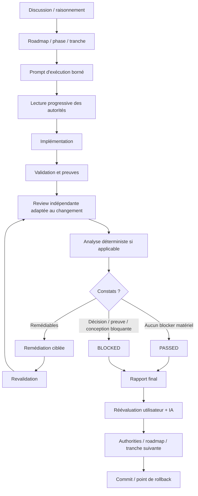

# Workflow d’ingénierie logicielle assistée par IA

Ce dépôt contient un workflow évolutif pour structurer le développement logiciel réalisé avec des assistants et agents IA.

Il s’est construit progressivement au fil de plusieurs projets et de l’évolution des capacités des modèles : d’une utilisation initialement centrée sur l’analyse, la compréhension et l’assistance ponctuelle au développement vers des tâches d’ingénierie de plus en plus autonomes, nécessitant davantage de cadrage, de contexte, de validation et de review.

L’objectif n’est pas de multiplier les documents, les agents ou les étapes de processus. Il est de fournir **juste assez de structure pour déléguer davantage sans perdre la maîtrise du périmètre, de l’architecture, des décisions et des preuves de validation**.

Ce dépôt représente l’état actuel de cette pratique. Il est amené à évoluer continuellement.

## Principes

### Une autorité principale par information normative

Architecture, contrats, décisions, roadmap, règles d’exécution et preuves n’ont pas le même rôle.

Une information durable doit posséder une autorité principale identifiable plutôt que d’être recopiée dans plusieurs documents susceptibles de diverger.

### Chargement progressif du contexte

Un agent ne doit pas lire l’ensemble du dépôt et de sa documentation « au cas où ».

Le contexte est chargé progressivement à partir de la tâche courante, des règles applicables et des autorités réellement nécessaires.

### Séparation du raisonnement, de l’autorité et de l’exécution

Le workflow distingue :

* **l’état de raisonnement** : hypothèses, alternatives, discussion, découpage et arbitrages ;
* **l’état d’autorité** : connaissance durable et acceptée du projet conservée dans le dépôt ;
* **l’état d’exécution** : implémentation, validations, reviews, remédiations et rapports de run.

Une idée discutée ne devient pas automatiquement une décision du projet, et un rapport d’exécution ne devient pas automatiquement une autorité.

### Travail par tranches bornées

Le travail est découpé en tranches cohérentes disposant d’un objectif, d’un périmètre et de critères de validation compréhensibles.

Le découpage suit les responsabilités et les invariants en interaction, plutôt qu’un nombre arbitraire de fichiers ou de lignes de code.

Le cadre reste volontairement flexible : un agent peut identifier qu’un dépassement du plan initial est nécessaire, mais celui-ci doit être rendu explicite et justifié plutôt que devenir une dérive silencieuse.

### Validation par les preuves

Des tests verts ne suffisent pas nécessairement à déclarer une tranche terminée.

Selon le projet et le risque, la validation peut inclure tests, analyse statique, build, mesures, qualification déterministe, comportement à échelle représentative, respect des contrats et cohérence architecturale.

### Review indépendante et proportionnée

L’implémentation et la review sont séparées.

Selon le changement, le workflow sélectionne le plus petit ensemble de reviewers spécialisés nécessaire, par exemple :

* conformité au contrat et au périmètre ;
* correctness comportementale ;
* qualité des tests et de la validation ;
* architecture, ownership et cohésion structurelle.

Des analyses déterministes telles que SonarQube peuvent compléter ces reviews lorsqu’elles sont configurées et pertinentes.

Les résultats sont consolidés avant acceptation et les constats remédiables peuvent être corrigés dans une boucle locale de validation et de re-review.

### `BLOCKED` est un résultat valide

Un agent ne doit pas inventer une décision structurante uniquement pour terminer une tâche.

Une tranche peut se terminer explicitement en `BLOCKED` lorsqu’une décision manque, que des autorités se contredisent, qu’une preuve nécessaire ne peut être obtenue ou que la conception courante ne permet pas de satisfaire le contrat.

### Réévaluation avant accumulation des corrections

Des blockers répétés ou une complexité corrective croissante peuvent indiquer que le problème n’est plus local.

Le workflow prévoit alors un checkpoint anti-dérive visant notamment à poser la question :

> Le blocker doit-il être corrigé dans la conception actuelle, ou indique-t-il que la conception elle-même doit être réévaluée ?

L’investissement déjà réalisé n’est pas considéré comme une justification suffisante pour poursuivre une mauvaise direction.

### Complexité proportionnée au besoin

Tous les projets n’ont pas besoin de toutes les autorités, de tous les reviewers ou de tous les outils présents dans ce dépôt.

Un mécanisme supplémentaire doit résoudre un problème identifiable.

L’objectif est de conserver le workflow aussi simple que possible sans perdre la fiabilité nécessaire.

## Vue générale

Le chemin exact dépend de la taille, du risque et de la nature du projet.

## Modèle documentaire

Le workflow définit plusieurs autorités possibles, sans imposer leur présence systématique.

| Autorité          | Rôle                                                      |
| ----------------- | --------------------------------------------------------- |
| `AGENTS.md`       | Règles permanentes applicables au travail des agents      |
| `ARCHITECTURE.md` | Architecture actuellement acceptée                        |
| `CODEBASE_MAP.md` | Routage compact entre responsabilités, code et autorités  |
| `adr/*`           | Justification des décisions architecturales durables      |
| `contracts/*`     | Invariants, frontières et comportements normatifs actuels |
| `ROADMAP.md`      | Trajectoire, état du projet, phases et gates              |
| `phases/*`        | Détail optionnel des phases complexes                     |
| `qualification/*` | Preuves, mesures et résultats de qualification            |

Tous ces documents ne sont pas nécessaires sur un petit projet.

Le modèle complet est décrit dans [`DOCUMENTATION_MODEL.md`](DOCUMENTATION_MODEL.md).

## Contenu du dépôt

### Workflow global

[`ENGINEERING_WORKFLOW.md`](ENGINEERING_WORKFLOW.md) décrit le processus complet : raisonnement, découpage, exécution, validation, review, remédiation, gestion des blockers, checkpoint anti-dérive, qualification, provenance et points de rollback.

[`DOCUMENTATION_MODEL.md`](DOCUMENTATION_MODEL.md) définit les différentes autorités documentaires, leurs responsabilités et le routage progressif du contexte.

### Agents

[`agents/AGENTS_BASE_TEMPLATE.md`](agents/AGENTS_BASE_TEMPLATE.md) fournit une base de `AGENTS.md` à adapter à chaque projet.

Les configurations suivantes définissent actuellement plusieurs reviewers spécialisés :

* [`agents/contract-reviewer.toml`](agents/contract-reviewer.toml)
* [`agents/correctness-reviewer.toml`](agents/correctness-reviewer.toml)
* [`agents/tests-reviewer.toml`](agents/tests-reviewer.toml)
* [`agents/architecture-reviewer.toml`](agents/architecture-reviewer.toml)

[`agents/review-and-remediate/SKILL.md`](agents/review-and-remediate/SKILL.md) contient le workflow opérationnel de sélection des reviewers, consolidation, remédiation et qualification finale d’une tranche.

### Architecture

* [`architecture/ARCHITECTURE_GUIDE.md`](architecture/ARCHITECTURE_GUIDE.md)
* [`architecture/ARCHITECTURE_TEMPLATE.md`](architecture/ARCHITECTURE_TEMPLATE.md)
* [`architecture/ARCHITECTURE_CHANGE_WORKFLOW.md`](architecture/ARCHITECTURE_CHANGE_WORKFLOW.md)

Ces fichiers définissent le rôle de l’autorité architecturale et la manière de gérer les changements architecturaux durables.

### Cartographie du code

* [`codebase-map/CODEBASE_MAP_GUIDE.md`](codebase-map/CODEBASE_MAP_GUIDE.md)
* [`codebase-map/CODEBASE_MAP_TEMPLATE.md`](codebase-map/CODEBASE_MAP_TEMPLATE.md)

Le codebase map est conçu comme un **routeur de contexte**, pas comme une reproduction exhaustive de l’arborescence du dépôt.

### ADR

* [`adr/ADR_GUIDE.md`](adr/ADR_GUIDE.md)
* [`adr/ADR_TEMPLATE.md`](adr/ADR_TEMPLATE.md)

Les ADR conservent le contexte et la justification des décisions architecturales durables.

### Contrats

* [`contracts/CONTRACT_GUIDE.md`](contracts/CONTRACT_GUIDE.md)
* [`contracts/CONTRACT_TEMPLATE.md`](contracts/CONTRACT_TEMPLATE.md)

Les contrats décrivent ce qui doit actuellement rester vrai à une frontière ou pour un comportement donné.

### Roadmap et phases

* [`roadmap/ROADMAP_GUIDE.md`](roadmap/ROADMAP_GUIDE.md)
* [`roadmap/ROADMAP_TEMPLATE.md`](roadmap/ROADMAP_TEMPLATE.md)
* [`roadmap/PHASE_PLAN_TEMPLATE.md`](roadmap/PHASE_PLAN_TEMPLATE.md)

La roadmap reste volontairement compacte. Un document de phase séparé n’est créé que lorsqu’il réduit réellement la complexité.

### Génération des prompts et sélection du modèle

[`prompts/CODEX_PROMPT_GUIDE.md`](prompts/CODEX_PROMPT_GUIDE.md) décrit la transformation du raisonnement et des autorités du projet en contrat d’exécution borné pour Codex.

[`prompts/MODEL_REASONING_SELECTION_GUIDE.md`](prompts/MODEL_REASONING_SELECTION_GUIDE.md) propose une sélection du modèle et du niveau de raisonnement fondée sur le **coût cognitif réel de la tranche**, plutôt que sur sa taille brute.

### Review et remédiation

[`review/REVIEW_AND_REMEDIATION_WORKFLOW.md`](review/REVIEW_AND_REMEDIATION_WORKFLOW.md) décrit les principes généraux de la review indépendante, de la consolidation des constats et de la remédiation.

Le skill [`agents/review-and-remediate/SKILL.md`](agents/review-and-remediate/SKILL.md) en constitue l’implémentation opérationnelle actuelle.

## Agnosticisme et implémentation actuelle

Les principes d’ingénierie, le modèle documentaire, la gestion du contexte, le découpage, les contrats, les gates et la séparation entre implémentation et review sont conçus pour rester largement indépendants d’un fournisseur ou d’un modèle particulier.

L’implémentation opérationnelle actuelle utilise cependant principalement **ChatGPT / OpenAI Codex** et contient donc des fichiers et configurations spécifiques à cet environnement.

Cette séparation est volontaire : les principes peuvent rester stables tandis que l’outillage évolue avec les capacités disponibles.

## Utilisation

Ce dépôt n’est pas destiné à être copié intégralement dans chaque projet.

Il sert plutôt de base dans laquelle sélectionner les éléments nécessaires :

1. définir les règles permanentes utiles dans `AGENTS.md` ;
2. créer uniquement les autorités documentaires dont le projet a réellement besoin ;
3. maintenir la roadmap comme routeur de l’état courant ;
4. découper le travail en tranches cohérentes ;
5. charger progressivement les autorités pertinentes ;
6. valider chaque tranche avec des preuves adaptées au risque ;
7. utiliser une review indépendante proportionnée au changement ;
8. faire évoluer les autorités lorsque la vérité acceptée du projet change.

Les mécanismes inutiles doivent rester absents.

## Langues

Les guides de ce dépôt sont principalement rédigés en français.

Les templates destinés à produire directement la documentation d’un projet sont en anglais par défaut.

Certaines configurations opérationnelles destinées aux agents sont également en anglais.

Cette convention peut évoluer indépendamment du workflow lui-même.

## Évolution

Ce dépôt doit être considéré comme une **photographie vivante d’une pratique d’ingénierie**, et non comme une méthode terminée.

Le workflow évolue en fonction :

* des problèmes réellement rencontrés sur les projets ;
* des mécanismes qui se révèlent utiles ou inutilement complexes ;
* de l’évolution des capacités de raisonnement et d’autonomie des modèles ;
* des nouveaux outils disponibles ;
* du retour obtenu sur les validations et les reviews.

Une règle ou une couche devenue inutile peut être supprimée aussi naturellement qu’une nouvelle peut être ajoutée.

L’objectif n’est pas de conserver le workflow actuel.

L’objectif est de conserver **le niveau de structure réellement nécessaire pour travailler de manière fiable avec les capacités disponibles à un instant donné**.
