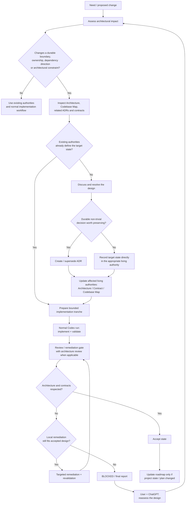

# Workflow de changement architectural

## Objectif

Ce workflow décrit le traitement d'un changement susceptible d'affecter une frontière,
un ownership, une direction de dépendance ou une contrainte architecturale durable.

Il complète le workflow d'ingénierie global. Il ne remplace ni le run Codex standard,
ni sa validation, ni la gate de review/remédiation.

Il n'impose pas un ADR pour chaque changement : la première étape consiste précisément
à déterminer si l'autorité existante suffit.

## Règles

- L'ADR conserve le **pourquoi** d'une décision durable ; l'architecture, les contrats
  et le codebase map conservent l'état vivant correspondant.
- Lorsque le skill `maintain-project-authorities` est installé, l'utiliser pour appliquer les
  créations ou mises à jour sémantiques des autorités structurées concernées.
- Une décision structurante absente des autorités ne doit pas être inventée
  silencieusement pendant l'implémentation.
- Une extraction interne de fichiers ou de sous-dossiers n'est pas automatiquement un
  changement architectural.
- Lorsque l'état cible est déjà défini par les autorités applicables, ne pas créer un
  nouvel ADR uniquement parce que l'implémentation est importante.
- Lorsqu'une décision durable existante est remplacée, créer un nouvel ADR ou
  superseder explicitement l'ancien plutôt que de réécrire silencieusement l'historique.
- La review doit vérifier les frontières, ownerships, dépendances et contrats affectés,
  pas uniquement la correction locale du code.
- La gate de review/remédiation reste proportionnée au changement, mais un changement
  matériel d'architecture justifie normalement une review architecturale.
- Si l'implémentation ou la review montre que la décision acceptée n'est plus viable,
  revenir au raisonnement et aux autorités plutôt que d'empiler des remédiations locales.
- Mettre à jour `ROADMAP.md` seulement lorsque le changement modifie réellement l'état,
  le gate, la prochaine tranche, une dépendance ou la trajectoire du projet.
