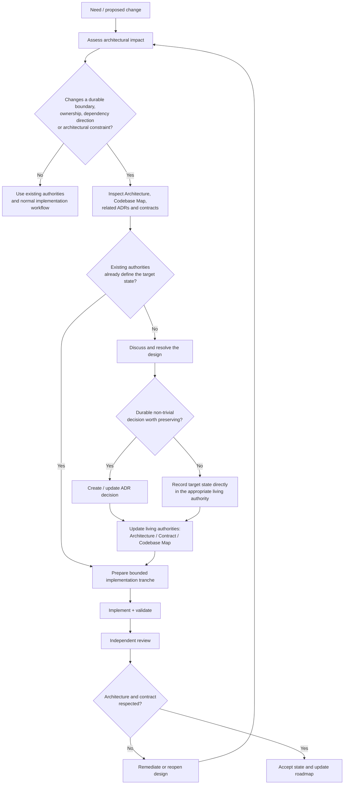

# Workflow de changement architectural

## Objectif

Ce workflow décrit le traitement d'un changement susceptible d'affecter une frontière, un ownership, une direction de dépendance ou une contrainte architecturale durable.

Il n'impose pas un ADR pour chaque changement : la première étape consiste précisément à déterminer si l'autorité existante suffit.

## Règles

- L'ADR conserve la décision ; l'architecture et les contrats conservent l'état vivant.
- Une décision structurante absente des autorités ne doit pas être inventée silencieusement pendant l'implémentation.
- Une extraction interne de fichiers ou de sous-dossiers n'est pas automatiquement un changement architectural.
- La review doit vérifier le respect des frontières et contrats, pas uniquement la correction locale du code.
