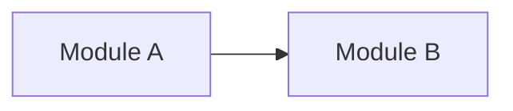

# Architecture

> Describe the currently accepted architecture. Replace superseded structure instead of preserving decision or implementation history here.

## Architectural model

<e.g. modular monolith / hexagonal / layered / ECS / other, with only the project-specific meaning that matters.>

## System boundaries

- <major external/internal boundary>

## Major responsibilities

### <Module / subsystem>

- **Owns:** <primary responsibilities>
- **Depends on:** <major allowed dependencies>
- **Must not depend on:** <important forbidden dependency, if any>

## Dependency direction

## Major flows

<Only flows whose shape matters architecturally. Use a compact Mermaid diagram when clearer than prose.>

## Cross-cutting constraints

- <architectural constraint that applies across modules>

## Related authorities

- [Codebase map](CODEBASE_MAP.md)
- <ADR / contract links only when useful>
