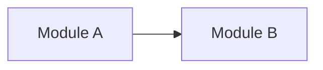

# Codebase Map

This file is a compact context router. It maps architectural responsibilities to their primary code locations and authorities; it is not a complete file tree.

## Overview

## Modules

### <Module A>

- **Path:** `<primary/path>`
- **Owns:** <concise responsibilities>
- **Depends on:** <major modules>
- **Must not depend on:** <important forbidden dependencies, if any>
- **Contract:** [<contract>](<path>)
- **ADRs:** [<ADR>](<path>)

### <Module B>

- **Path:** `<primary/path>`
- **Owns:** <concise responsibilities>
- **Depends on:** <major modules>
