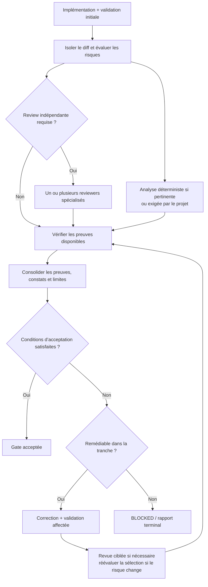

# Workflow de revue et remédiation

## Place dans le run

La revue/remédiation intervient après l’implémentation et la validation initiale, avant le
rapport terminal. Le [workflow global](../ENGINEERING_WORKFLOW.md) définit le cycle du run,
ses statuts et le passage de relais à l’utilisateur + ChatGPT.

Le [skill `review-and-remediate`](review-and-remediate/SKILL.md) est la source de référence
des règles de revue. Il peut être suivi directement même sans installation. Ce document
en donne une vue d’ensemble ; il ne maintient pas une seconde définition des règles.

## Lire la procédure selon le besoin

| Question | Source de référence |
| --- | --- |
| Quel diff et quelles exigences examiner ? | [Établir la cible](review-and-remediate/SKILL.md#1-establish-the-review-target) |
| Aucun, un ou plusieurs reviewers ? Une analyse déterministe ? | [Sélection selon le risque](review-and-remediate/SKILL.md#2-select-review-according-to-risk) |
| Quel contexte donner à chaque rôle ? | [Routage du contexte](review-and-remediate/SKILL.md#3-route-context-deliberately) |
| Quelle configuration utiliser ? | [Configuration des reviewers](review-and-remediate/SKILL.md#4-use-stable-reviewer-configurations) |
| Quelles preuves, quels constats et quelles limites restituer ? | [Résultat structuré](review-and-remediate/SKILL.md#5-require-structured-review-results) |
| Que corriger, différer ou soumettre à décision ? | [Traitement des constats](review-and-remediate/SKILL.md#6-disposition-every-finding) |
| Comment accepter et rendre compte ? | [Clôture de la gate](review-and-remediate/SKILL.md#7-close-the-gate-and-report) |

La sélection peut aboutir à aucun reviewer pour une petite modification locale dont le
risque est délimité et les preuves suffisantes, à un reviewer pour un risque précis, ou à
plusieurs rôles couvrant des risques distincts. Les critères et exceptions restent définis
dans la procédure liée ci-dessus.

## Vue d’ensemble

La décision repose sur le contrat de la tranche, les preuves obtenues et le traitement des
constats. L’absence de reviewer est une issue explicite de la sélection ; les validations
requises restent applicables.
