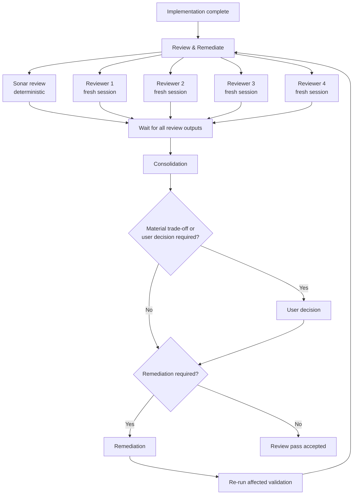

# Workflow de review et remédiation

## Objectif

Après une tranche d'implémentation terminée et qualifiée par l'exécuteur, lancer des revues indépendantes, consolider leurs résultats puis remédier jusqu'à obtention d'un résultat acceptable ou jusqu'à nécessité d'un arbitrage utilisateur.

## Principes

- Les reviewers travaillent en sessions fraîches pour limiter la contamination par le raisonnement de l'exécuteur.
- La consolidation déduplique les constats, résout les contradictions factuelles lorsque les preuves le permettent et rend visibles les désaccords restants.
- Un gros trade-off, une modification de contrat ou une décision architecturale non établie remonte à l'utilisateur au lieu d'être arbitrée silencieusement.
- Toute remédiation significative repasse par les validations affectées puis par une nouvelle passe de review adaptée au changement.
- Le succès d'une tranche n'est pas défini uniquement par des tests verts : le contrat, les frontières architecturales et les critères de qualification applicables doivent également être respectés.
