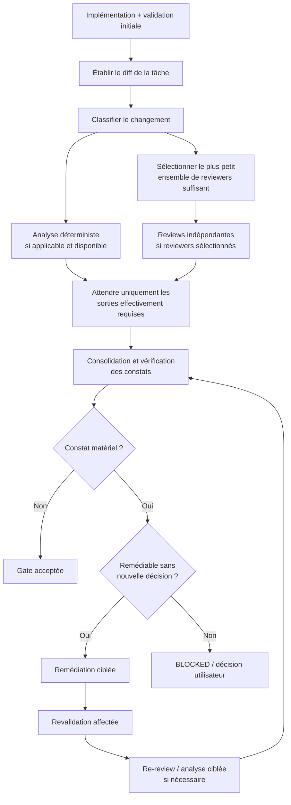

# Workflow de review et remédiation

## Objectif

Après une tranche d’implémentation et sa validation initiale, appliquer une gate de review proportionnée au changement, consolider les constats puis remédier jusqu’à obtention d’un résultat acceptable ou jusqu’à nécessité d’un arbitrage.

Ce document décrit la politique générale. Lorsque le skill `review-and-remediate` est installé, son `SKILL.md` constitue la procédure opérationnelle détaillée.

Le passage par cette gate ne signifie pas qu’un nombre fixe de reviewers ou qu’une analyse déterministe doivent être exécutés à chaque tranche.

## Principe de sélection

L’agent principal commence par isoler le diff attribuable à la tâche courante puis classe le changement.

Il sélectionne **le plus petit ensemble de reviewers suffisant** :

| Type de changement | Review par défaut |
| --- | --- |
| Pas de diff effectif, analyse seule, provenance `.ai-history/**` seule | Aucun reviewer |
| Documentation seule | Aucun reviewer de code, sauf changement d’autorité, contrat, décision architecturale ou procédure exécutable |
| Implémentation/refactor petit et local | Contrat + correctness |
| Implémentation comportementale normale | Contrat + correctness + tests |
| Changement matériel de structure, ownership, dépendances, frontières ou abstraction partagée | Ajouter architecture |
| Travail transversal, architectural, contrat public, schéma, migration, persistance, concurrence, sécurité, identité ou canonicalisation | Ajouter architecture |

La taille brute d’un fichier ou d’un diff n’est pas un critère suffisant pour sélectionner une review architecturale.

Les reviewers sélectionnés sont lancés en parallèle lorsqu’il y en a plusieurs.

## Analyse déterministe

Une analyse déterministe telle que SonarQube peut compléter la review lorsqu’elle est :

- configurée pour le projet ;
- exploitable sur l’état courant du dépôt ;
- pertinente pour le type de changement.

Elle n’est pas obligatoire par défaut.

Si elle est indisponible ou échoue pour une raison externe au changement, le workflow continue normalement et cette indisponibilité est rapportée, sauf si une autorité propre au projet en fait explicitement une gate obligatoire.

Ne jamais utiliser de résultat SonarQube périmé comme preuve du worktree courant.

Les constats déterministes restent séparés des contextes des reviewers LLM et sont consolidés par l’agent principal.

## Routage du contexte

Les reviewers travaillent dans des contextes indépendants de l’exécuteur et, autant que possible, indépendants les uns des autres.

Ils ne reçoivent pas le raisonnement interne de l’implémentation ni un rapport final provisoire.

Le contexte fourni dépend de leur responsabilité :

- **contract reviewer** : prompt d’implémentation complet, diff cible, autorités et critères d’acceptation ;
- **correctness reviewer** : objectif comportemental, invariants, diff cible et accès au code nécessaire pour tracer le comportement ;
- **tests reviewer** : comportement attendu, changements production/tests, critères d’acceptation et validations pertinentes ;
- **architecture reviewer** : diff, autorités architecturales, frontières, ownership, abstractions partagées et unités sources nécessaires.

Les reviewers peuvent inspecter d’autres fichiers lorsqu’ils en ont besoin. Les références fournies sont des points d’entrée, pas des frontières d’exploration.

## Workflow

## Consolidation

L’agent principal vérifie chaque constat contre le dépôt avant d’agir.

Chaque constat est classé comme :

- accepté et corrigé ;
- accepté et différé ;
- rejeté avec preuve factuelle ;
- décision humaine requise.

Les constats issus d’une analyse déterministe suivent la même discipline de vérification, mais restent distincts des métriques de calibration des reviewers LLM.

Un constat ne doit jamais être supprimé silencieusement.

## Remédiation

Un constat accepté est corrigé dans la tranche courante par défaut lorsque la correction :

- reste compatible avec les autorités du dépôt ;
- ne nécessite pas de nouvelle décision produit ou architecturale ;
- ne transforme pas la tâche en refonte non bornée.

Après correction :

1. relancer les validations affectées ;
2. demander une vérification ciblée aux reviewers concernés lorsque nécessaire ;
3. relancer l’analyse déterministe uniquement si elle avait été utilisée et que le changement peut modifier son résultat ;
4. reconsolider.

Une correction critique ou de sévérité élevée doit recevoir une vérification indépendante ciblée.

Le workflow ne redémarre pas toute la tranche après chaque constat ordinaire.

## Arbitrage

Un trade-off matériel, une modification de contrat non autorisée, une décision architecturale absente, des autorités contradictoires ou une conception rendue non viable ne doivent pas être arbitrés silencieusement par l’exécuteur.

Dans ce cas, la gate peut se terminer en `BLOCKED` et le problème remonte à la couche de raisonnement utilisateur + IA.

## Acceptation

Le succès d’une tranche n’est pas défini uniquement par des tests verts.

Selon le changement, l’acceptation prend en compte :

- le contrat de la tranche ;
- les invariants applicables ;
- les validations requises ;
- les frontières architecturales ;
- les reviewers effectivement sélectionnés ;
- les analyses déterministes effectivement exécutées ;
- les remédiations et vérifications finales ;
- les risques ou décisions restant ouverts.

Lorsqu’aucun reviewer n’était requis, le rapport doit l’indiquer explicitement plutôt que de simuler une review inutile.

## Principe directeur

La review doit être **indépendante mais proportionnée**.

L’objectif n’est pas de maximiser le nombre d’agents ou de checks, mais d’obtenir le niveau de contradiction et de preuve réellement nécessaire pour accepter la tranche avec confiance.
